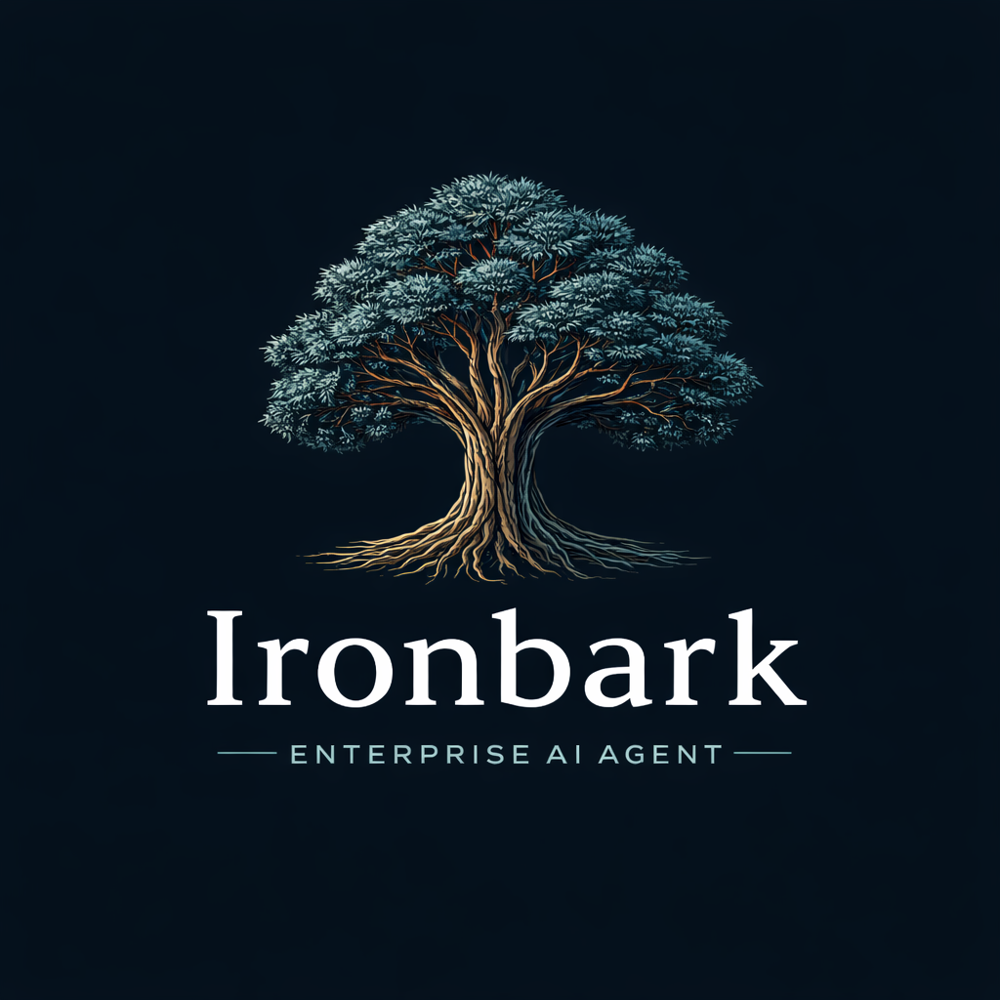

<p align="center">
  
</p>

<h1 align="center">Ironbark</h1>

<p align="center">
  <strong>AI agents your security team will actually approve.</strong>
</p>

<p align="center">
  The enterprise AI coding platform with centralised governance, Entra ID authentication,<br/>
  policy enforcement, and a full audit trail &mdash; so your developers ship faster<br/>
  without your CISO losing sleep.
</p>

<p align="center">
  <a href="#why-ironbark">Why Ironbark</a> &middot;
  <a href="#admin-console">Admin Console</a> &middot;
  <a href="#the-agent">The Agent</a> &middot;
  <a href="#getting-started">Getting Started</a> &middot;
  <a href="#pricing">Pricing</a> &middot;
  <a href="SECURITY.md">Security</a>
</p>

<p align="center">
  
  
  
  
  
</p>

<br/>

<p align="center">
  
</p>

<br/>

---

<br/>

## Why Ironbark

Most AI coding tools are built for individuals. Ironbark is built for **teams that answer to compliance**.

<table>
<tr>
<td width="50%" valign="top">

### The problem

- Developers adopt AI tools faster than security can review them
- API keys and credentials scattered across individual machines
- No visibility into what the AI is doing, reading, or changing
- No way to enforce model policies, tool restrictions, or file access rules
- Audit and compliance teams have zero coverage over AI-assisted work

</td>
<td width="50%" valign="top">

### How Ironbark solves it

- **One platform**, centrally managed by your admin team
- **Zero developer-managed credentials** &mdash; all API keys provisioned and encrypted by admins
- **Full audit trail** of every agent action, tool call, and model interaction
- **Policy engine** that enforces what models, tools, and files are accessible per role
- **HMAC-signed config** that developers cannot override or tamper with

</td>
</tr>
</table>

<br/>

> **"Give every developer an AI agent. Give your security team the controls."**

<br/>

---

<br/>

## How It Works

Ironbark has two halves: the **Admin Console** where your platform team configures everything, and the **Agent** that your developers actually use. Developers never manage API keys, choose models, or configure policies &mdash; that's all handled centrally.

```
┌─────────────────────────────────────────────────────────────────┐
│                        Admin Console                            │
│  Providers  ·  Policies  ·  Roles  ·  AppSec  ·  Audit Trail   │
└──────────────────────────┬──────────────────────────────────────┘
                           │  HMAC-signed config
                           │  + enrollment tokens
                           ▼
┌─────────────────────────────────────────────────────────────────┐
│                     Ironbark Agent (TUI)                        │
│  Build  ·  Plan  ·  Explore  ·  Code  ·  Shell  ·  Sub-agents  │
└─────────────────────────────────────────────────────────────────┘
```

1. **Admins** deploy the Admin Console and configure providers, models, policies, and roles
2. **Admins** generate pre-configured agent binaries with embedded enrollment tokens
3. **Developers** download the binary, authenticate with Entra ID, and start coding
4. **No API keys on developer machines.** Ever.

<br/>

---

<br/>

## Admin Console

A dedicated dashboard that gives your platform team full control over the AI agent fleet.

<table>
<tr>
<td width="50%" valign="top">

### Fleet Management
- **Dashboard** with real-time agent fleet monitoring
- **User management** auto-provisioned from Microsoft Entra ID
- **Role-based access control** mapped to Entra AD groups
- **Usage tracking** with per-user and per-model cost breakdowns
- **Audit trail** of every agent action across the organisation

</td>
<td width="50%" valign="top">

### Governance & Policy
- **Model catalog** with encrypted API key storage (AES-256-GCM)
- **Policy builder** to restrict tools, files, and models per role
- **Token budgets** and rate limits per user, team, or role
- **HMAC-SHA256 signed config** distributed to agents &mdash; tamper-proof
- **Managed agent personas** (build, plan, explore, general)

</td>
</tr>
</table>

<table>
<tr>
<td width="50%" valign="top">

### Application Security
- **Checkmarx SAST/SCA** scanning via MCP proxy
- **Semgrep** static analysis integration
- **Sonatype** dependency vulnerability checks
- **Credentials never leave the server** &mdash; AppSec tools are proxied through the admin console so developer machines never see scanner tokens

</td>
<td width="50%" valign="top">

### Distribution & Branding
- **Pre-configured binary downloads** with embedded enrollment tokens
- **Zero-config deployment** &mdash; developers just download and authenticate
- **White-label branding** &mdash; customise logos, colours, and names
- **Enrolment management** &mdash; track which binaries are deployed where

</td>
</tr>
</table>

### Supported Providers

Configure any combination of providers in the admin console. Developers see only what you allow.

<details>
<summary><strong>Full provider list (21+)</strong></summary>

| Provider | Example Models |
|----------|----------------|
| Anthropic | Claude Opus, Sonnet, Haiku |
| OpenAI | GPT-5, GPT-4.1, o3, o4-mini |
| Google | Gemini 2.5 Pro, Flash |
| AWS Bedrock | Claude, Titan, Mistral |
| Azure OpenAI | GPT-4.1, o3 |
| GitHub Copilot | Enterprise models via Responses API |
| Mistral | Large, Medium, Small |
| xAI | Grok |
| Groq | LLaMA, Mixtral |
| Cohere | Command R+ |
| OpenRouter | 100+ aggregated models |
| Together AI | Open-source models |
| Perplexity | Online search models |
| Cerebras | Fast inference |
| DeepInfra | Open-source hosting |
| Vercel | AI Gateway |
| GitLab | GitLab Duo |

</details>

<br/>

---

<br/>

## The Agent

A rich terminal interface (TUI) where developers interact with AI. Compiled to a single native binary &mdash; zero runtime dependencies.

### Agent Modes

Purpose-built agent personas, each tuned for a different workflow:

| Mode | Purpose |
|------|---------|
| **Build** | Full agentic coding &mdash; reads, edits, runs, tests |
| **Plan** | Architecture and design &mdash; explores and plans without modifying files |
| **Explore** | Codebase research &mdash; fast, read-only exploration |
| **General** | Open-ended conversation and problem-solving |

Switch modes mid-session. Admins control which modes are available per role.

### Agentic Tools

The agent doesn't just chat &mdash; it **acts**. It reads your codebase, makes surgical edits, runs commands, searches the web, and delegates to sub-agents, all within the guardrails your admin team defines.

| Tool | What it does |
|------|-------------|
| `bash` | Execute shell commands with approval |
| `edit` | Surgical file edits with inline diffs |
| `write` | Create new files |
| `read` | Read files with syntax awareness |
| `grep` / `glob` | Search code content and file patterns |
| `apply_patch` | Apply multi-file patches |
| `webfetch` | Fetch and analyse web content |
| `task` | Delegate to specialised sub-agents |
| `lsp` | Language Server diagnostics |
| `todowrite` | Track progress on complex tasks |

### Session Management

Every conversation is persistent and powerful:

- **Undo / Redo** &mdash; roll back any agent action, including file changes
- **Session forking** &mdash; branch a conversation to explore alternatives
- **Checkpoints** &mdash; save and restore session state at any point
- **Session branching** &mdash; visualise the conversation tree across forks
- **Background sessions** &mdash; kick off sub-agents and continue working

### Terminal Experience

- **Syntax-highlighted diffs** with inline approval
- **Live progress** &mdash; see tool calls executing in real time with elapsed timers
- **Typing indicators** &mdash; know when the AI is thinking
- **Command palette** &mdash; fuzzy-searchable with categories and keybind hints
- **40+ keyboard shortcuts** with vim-style navigation and a built-in cheatsheet
- **Notification center** &mdash; background task completions, errors, MCP status
- **Adaptive prompt hints** &mdash; contextual tips that change based on conversation state
- **Themes** &mdash; customisable colour schemes
- **File attachments** &mdash; drag and drop files into the prompt
- **Shell mode** &mdash; run shell commands inline without leaving the agent

### Model Context Protocol (MCP)

Extend the agent with any MCP-compatible server. Connect databases, APIs, documentation, or custom tools &mdash; the agent uses them as naturally as built-in tools.

Admins can manage MCP servers centrally, or allow project-level configuration:

```jsonc
// .ironbark/ironbark.jsonc
{
  "mcp": {
    "postgres": {
      "command": "npx",
      "args": ["@modelcontextprotocol/server-postgres", "postgresql://..."]
    }
  }
}
```

### Extensibility

Make Ironbark your own with project-level customisations:

```
.ironbark/
├── agent/       # Custom agent personas (e.g. "reviewer", "architect")
├── command/     # Custom slash commands
├── skill/       # Reusable multi-step capabilities
├── themes/      # UI colour schemes
└── tool/        # Custom tool definitions
```

<br/>

---

<br/>

## Runs Everywhere

| Surface | Technology | Description |
|---------|-----------|-------------|
| **CLI / TUI** | Native binary (Bun compiled) | Terminal-first AI agent |
| **Desktop** | Tauri v2 | Native app for macOS, Linux, Windows |
| **Web** | SolidJS | Browser-based session management |
| **VS Code** | Extension | Inline AI in your editor |
| **SDK** | `@ironbark-ai/sdk` | Build custom integrations |
| **Plugin** | `@ironbark-ai/plugin` | Extend agent capabilities |

<br/>

---

<br/>

## Getting Started

### For Admins

Deploy the admin console, configure your providers, policies, and roles, then distribute pre-configured agent binaries to your team.

```bash
docker pull vindcom/ironbark-admin
docker run -p 3000:3000 \
  -e DATABASE_URL="postgres://..." \
  -e REDIS_URL="redis://..." \
  -e ENTRA_TENANT_ID="..." \
  -e ENTRA_CLIENT_ID="..." \
  -e ENTRA_CLIENT_SECRET="..." \
  -e ENCRYPTION_KEY="..." \
  vindcom/ironbark-admin
```

**Requirements:** PostgreSQL 15+ &middot; Redis 7+ &middot; Microsoft Entra ID tenant

### For Developers

Download the pre-configured binary from your admin team, or install via npm:

```bash
npm install -g ironbark-ai
ironbark
```

Authenticate with your organisation's Entra ID and start coding. No API keys needed &mdash; your admin team has already configured everything.

<details>
<summary><strong>Platform support</strong></summary>

| Platform | Architectures |
|----------|--------------|
| Linux (glibc) | x64, arm64 |
| Linux (musl) | x64, arm64 |
| Windows | x64 |
| macOS | x64, arm64 |

Single binary, zero runtime dependencies.
</details>

<br/>

---

<br/>

## Security

Ironbark is built for environments where security is non-negotiable.

| Control | Implementation |
|---------|---------------|
| Authentication | Microsoft Entra ID (PKCE + Device Code Flow) |
| Authorisation | Fine-grained RBAC mapped to Entra AD groups |
| Credential isolation | All API keys encrypted server-side (AES-256-GCM), never on developer machines |
| Policy enforcement | Centrally managed tool, file, and model access rules per role |
| Config integrity | HMAC-SHA256 signed configuration &mdash; agents reject tampered config |
| AppSec scanning | Checkmarx, Semgrep, Sonatype via MCP proxy &mdash; scanner credentials never leave server |
| Network isolation | Agent server mode restricted to loopback (`127.0.0.1`) |
| Audit logging | Every agent action logged with user identity, timestamp, and full context |
| Token lifecycle | Short-lived enrollment and session tokens with automatic rotation |

For the full threat model: [SECURITY.md](./SECURITY.md)

To report a vulnerability: **security@vindcom.com.au**

<br/>

---

<br/>

## Pricing

<table>
<tr>
<td width="50%" valign="top">

### Free

**1 agent seat** &mdash; free forever. No credit card, no trial period.

- Full Admin Console
- All agent modes (Build, Plan, Explore, General)
- All 21+ provider integrations
- Entra ID authentication
- RBAC, policies, and audit trail
- MCP integration
- All platform surfaces (CLI, Desktop, Web, VS Code)

*Everything you need to evaluate Ironbark with your team.*

</td>
<td width="50%" valign="top">

### Team &amp; Enterprise

**Per-agent seat licensing** for teams that need more than one agent.

Everything in Free, plus:

- Unlimited agent seats
- Priority support
- Custom SLAs

For pricing: **contact@vindcom.com.au**

</td>
</tr>
</table>

<br/>

---

<br/>

## Contact

- **Sales & Licensing:** contact@vindcom.com.au
- **Security:** security@vindcom.com.au
- **Website:** [vindcom.com.au](https://vindcom.com.au)

<br/>

---

<br/>

## License

Proprietary software. Copyright &copy; 2025 VINDCOM Pty Ltd. All rights reserved.

Free for single-agent use. Additional agent seats require a paid license.

See [LICENSE](./LICENSE) for the full terms.

<br/>

---

<p align="center">
  <br/>
  <a href="https://vindcom.com.au"><strong>VINDCOM</strong></a>
  <br/>
  <sub>Enterprise AI, built in Australia.</sub>
  <br/><br/>
</p>
